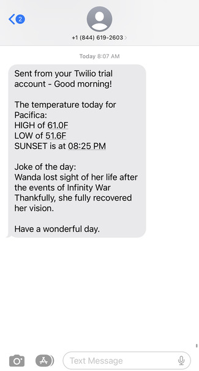

# Morning Message - Twilio App

## Summary
*Morning Message* sends a daily sms message with the high/low temps and sunset time for your location, as well as a daily dad joke. The message can be scheduled with GitHub Actions and utilizes a weather API and dad joke API.

## Demo

## How Can I Use It?
1. Create Twilio Account - https://www.twilio.com/try-twilio 
2. Follow directions to get Twilio phone number and locate your account SID and Auth token.
3. Get API keys:
    - Weather: https://rapidapi.com/weatherapi/api/weatherapi-com/ 
    - Dad Jokes: https://rapidapi.com/KegenGuyll/api/dad-jokes/ 
4. If scheduling through GitHub actions, start by saving both API keys, Twilio account SID and Twilio Auth Token as Secrets. 
Save as JOKE_API_KEY, WEATHER_API_KEY, TWILIO_ACCOUNT_SID, TWILIO_AUTH_TOKEN
    - Secrets Documentation: https://docs.github.com/en/actions/security-guides/encrypted-secrets#creating-encrypted-secrets-for-a-repository 
5. To customize the weather for your area, input your zipcode as the first value of "querystring" within the Python file (circled in red). If you'd like to send the message at a custom time (default is 15:00 UTC), that can be changed under "schedule" in the YAML file. For help with cron syntax check out https://crontab.guru/ 
 

## Future Improvements
Here are a few of the endless possible improvements:
- **Google Calendar integration:** receive a snapshot of your day in your *Morning Message*
- **Apple Reminders:** receive a list of today's scheduled reminders
- **Spotify/Apple Music:** Receive a new Spotify/Apple Music playlist each morning to listen to while starting your day
- **News:** Include a link to a news article within a topic of your choosing